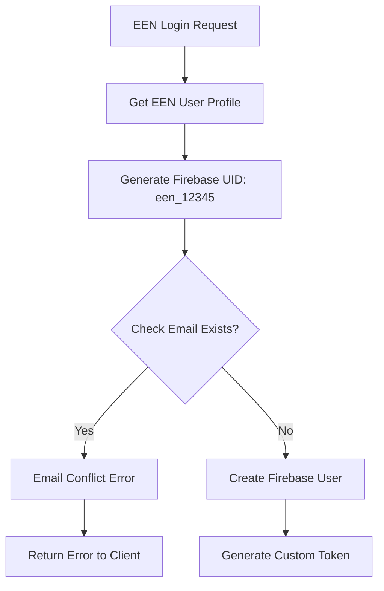

# Firebase Authentication Architecture

## Overview

This application implements a custom Firebase authentication system that integrates with Eagle Eye Networks (EEN) OAuth. The system creates Firebase users with deterministic UIDs based on EEN user IDs.

## UID Generation Strategy

```javascript
const firebaseUid = `een_${sanitizedEenUserId}`;
```

### Benefits
- **Consistent UIDs**: Same EEN user always gets the same Firebase UID
- **Predictable**: Easy to debug and trace user accounts
- **Secure**: EEN user ID validation ensures authenticity

### Trade-offs
- **Email Conflicts**: Cannot coexist with other Firebase auth methods for the same email
- **Migration Complexity**: Existing Firebase users cannot easily switch to EEN auth

## Admin Account Conflicts

### The Problem

Firebase enforces email uniqueness across all authentication providers. When an admin user has:

1. **Existing Firebase account** (Google, email/password, etc.) with UID: `abc123xyz`
2. **EEN account** with the same email and EEN user ID: `12345`

The system cannot create a new user with UID `een_12345` because the email is already taken.

### Technical Flow



### Error Handling

The system now provides clear error messages:

```javascript
// functions/index.js
if (existingUserByEmail && !existingUserByUid) {
  throw new HttpsError(
    "already-exists",
    `The email address ${sanitizedEenUserEmail} is already in use by another account. Please contact support to link your accounts.`
  );
}
```

## Solutions for Admin Users

### Option 1: Separate Email (Recommended)

**Pros:**
- ✅ No data loss
- ✅ Quick setup
- ✅ No technical complexity

**Cons:**
- ❌ Requires separate EEN account
- ❌ Additional email management

### Option 2: Account Migration (Advanced)

**Manual Process:**
1. Export existing Firebase user data
2. Delete existing Firebase user
3. Create new user with EEN UID
4. Import data to new account

**Code Example:**
```javascript
// Admin SDK - Delete existing user
await adminAuth.deleteUser(existingUser.uid);

// Create new user with EEN UID
await adminAuth.createUser({
  uid: `een_${eenUserId}`,
  email: userEmail,
  emailVerified: true,
  customClaims: eenClaims
});
```

### Option 3: UID Mapping (Future Enhancement)

**Concept:** Store mapping between existing UIDs and EEN user IDs

```javascript
// Firestore collection: uid_mappings
{
  eenUserId: "12345",
  firebaseUid: "abc123xyz", // Existing UID
  email: "admin@example.com",
  migrated: true
}
```

## Security Considerations

### Email Verification
- EEN API validates email ownership
- Firebase user created with `emailVerified: true`
- Custom claims include EEN user metadata

### Token Security
- Custom tokens expire in 1 hour
- ID tokens refresh automatically
- EEN access token validated on each request

## Monitoring and Debugging

### Logs to Watch
```javascript
// Success case
logger.info("Created new Firebase user:", firebaseUid);

// Conflict case
logger.error("Email conflict:", {
  providedEmail: sanitizedEenUserEmail,
  existingUid: existingUserByEmail.uid,
  attemptedUid: firebaseUid
});
```

### Firebase Console
- Check Authentication > Users for UID patterns
- Look for users with `een_` prefix
- Monitor custom claims in user details

## Testing

### Test Cases
1. **New EEN user** → Should create Firebase user successfully
2. **Existing EEN user** → Should update existing Firebase user
3. **Email conflict** → Should return clear error message
4. **Invalid EEN token** → Should reject authentication

### Test Data
```javascript
// Valid EEN user (no conflict)
{
  eenUserId: "test123",
  eenUserEmail: "test@example.com",
  eenAccessToken: "valid_token"
}

// Conflicting email
{
  eenUserId: "admin456", 
  eenUserEmail: "admin@firebase-project.com", // Already exists
  eenAccessToken: "valid_token"
}
```

## Future Improvements

1. **Automatic Account Linking**: Detect conflicts and offer migration
2. **Multiple Auth Providers**: Support both EEN and traditional Firebase auth
3. **Admin Override**: Allow admins to force account linking
4. **Migration Tools**: Automated scripts for bulk user migration

## Conclusion

The current architecture prioritizes security and consistency over flexibility. Admin users with existing Firebase accounts represent an edge case that requires manual intervention or alternative email addresses. This is an acceptable trade-off for the security benefits of the EEN integration. 