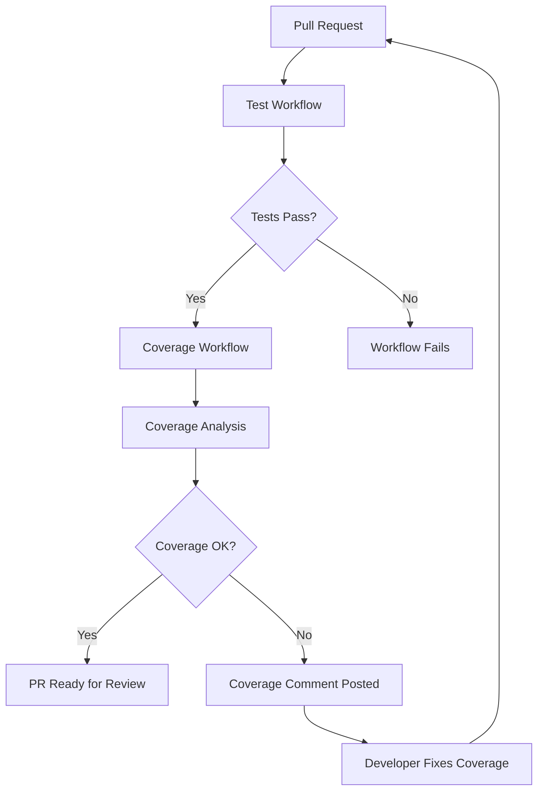

# GitHub Test Coverage Workflow

This document explains the automated test coverage evaluation system that runs on GitHub Actions for pull requests and workflow completions.

## 🎯 Overview

The Test Coverage workflow (`test-coverage.yml`) automatically evaluates code coverage whenever:
- A pull request is opened, synchronized, or reopened against `production` or `develop` branches
- The existing test workflow completes successfully
- Manually triggered via workflow dispatch

## 🔄 Workflow Triggers

### 1. **Automatic Trigger (Recommended)**
```yaml
workflow_run:
  workflows: ["Test Branch with Playwright against Vite Server"]
  types: [completed]
```
- Runs after the main test workflow succeeds
- Ensures tests have already passed before evaluating coverage
- Works on all branches

### 2. **Pull Request Trigger**
```yaml
pull_request:
  branches: [production, develop]
  types: [opened, synchronize, reopened]
```
- Runs directly on PR events
- Provides immediate coverage feedback
- Independent of other workflows

### 3. **Manual Trigger**
```yaml
workflow_dispatch:
```
- Can be triggered manually from GitHub Actions tab
- Useful for testing and debugging coverage issues

## 📊 Coverage Evaluation Process

### Step-by-Step Execution

1. **Environment Setup**
   - Checkout source code (handles workflow_run branch correctly)
   - Setup Node.js 20.19.0+ with npm cache
   - Install dependencies and Playwright browsers

2. **Coverage Collection**
   - Clean previous coverage data
   - Start Vite server with `NODE_ENV=test` for Istanbul instrumentation
   - Verify coverage instrumentation is working
   - Run all Playwright tests with coverage collection
   - Stop development server

3. **Coverage Processing**
   - Process raw coverage data using NYC
   - Generate HTML, text, JSON, and LCOV reports
   - Extract coverage percentages for all metrics

4. **Results Evaluation**
   - Compare coverage against thresholds from `.nycrc.json`
   - Generate pass/fail status for each metric
   - Determine overall coverage status

5. **Reporting**
   - Comment on PR with detailed coverage results (if applicable)
   - Upload coverage reports as workflow artifacts
   - Fail workflow if coverage thresholds not met

## 🎯 Coverage Thresholds

The workflow uses thresholds defined in `.nycrc.json`:

```json
{
  "statements": 25,    // Minimum 25% statement coverage
  "branches": 10,      // Minimum 10% branch coverage  
  "functions": 20,     // Minimum 20% function coverage
  "lines": 25          // Minimum 25% line coverage
}
```

**Overall Pass Criteria**: ALL four thresholds must be met for the workflow to pass.

## 💬 PR Comments

When triggered by a pull request, the workflow automatically posts a detailed comment:

### Comment Structure

```markdown
## 📊 Test Coverage Report

**Overall Status**: ✅ PASS / ❌ FAIL

| Metric | Coverage | Threshold | Status |
|--------|----------|-----------|--------|
| Statements | 30.06% | 25% | ✅ |
| Branches | 12.93% | 10% | ✅ |
| Functions | 26.9% | 20% | ✅ |
| Lines | 30.27% | 25% | ✅ |

### 📈 Coverage Details
- Detailed breakdown of each metric vs threshold

### 📋 What This Means
- Pass: Congratulations message with next steps
- Fail: Guidance on improving coverage

### 🔍 Coverage Reports
- Information about downloadable artifacts

### 🚀 Next Steps
- Specific recommendations based on results
```

## 📁 Generated Artifacts

The workflow uploads comprehensive coverage data:

### 1. **Coverage Reports** (30-day retention)
- `coverage/reports/index.html` - Interactive HTML report
- `coverage/reports/coverage-summary.json` - Machine-readable summary
- `coverage/reports/lcov.info` - LCOV format for external tools

### 2. **Coverage Raw Data** (14-day retention)
- `coverage/tmp/` - Raw coverage files from browser
- `coverage/` - Complete coverage directory structure

## 🔧 Configuration

### Environment Variables

The workflow requires the same environment variables as the main test workflow:

```yaml
env:
  # EEN API Configuration
  VITE_EEN_CLIENT_ID: ${{ secrets.VITE_EEN_CLIENT_ID }}
  VITE_EEN_CLIENT_SECRET: ${{ secrets.VITE_EEN_CLIENT_SECRET }}
  VITE_REDIRECT_URI: ${{ secrets.VITE_REDIRECT_URI }}
  
  # Firebase Configuration
  VITE_FIREBASE_API_KEY: ${{ secrets.VITE_FIREBASE_API_KEY }}
  VITE_FIREBASE_AUTH_DOMAIN: ${{ secrets.VITE_FIREBASE_AUTH_DOMAIN }}
  # ... other Firebase secrets
  
  # Test Credentials
  TEST_USER: ${{ secrets.TEST_USER }}
  TEST_PASSWORD: ${{ secrets.TEST_PASSWORD }}
  
  # Critical: Enable coverage instrumentation
  NODE_ENV: test
```

### Required Secrets

Ensure these GitHub secrets are configured:
- All `VITE_EEN_*` secrets for EEN API access
- All `VITE_FIREBASE_*` secrets for Firebase integration
- `TEST_USER` and `TEST_PASSWORD` for authenticated test scenarios

## 🚨 Troubleshooting

### Common Issues

#### 1. **Coverage Instrumentation Not Working**
**Symptoms**: No coverage data collected, empty reports
**Solution**: 
- Verify `NODE_ENV=test` is set
- Check Vite configuration includes Istanbul plugin
- Run debug test to verify instrumentation

#### 2. **Server Startup Failures**
**Symptoms**: Server timeout during startup
**Solutions**:
- Check for port conflicts
- Verify all environment variables are set
- Review server logs in workflow output

#### 3. **Threshold Failures**
**Symptoms**: Workflow fails with coverage below thresholds
**Solutions**:
- Review coverage report to identify uncovered code
- Add tests for critical functionality
- Consider adjusting thresholds in `.nycrc.json` if appropriate

#### 4. **PR Comments Not Posted**
**Symptoms**: Coverage runs but no PR comment appears
**Solutions**:
- Verify workflow triggered by `pull_request` event
- Check repository permissions for GitHub Actions
- Review step outputs for PR comment generation

### Debug Commands

```bash
# Test coverage locally
npm run test:coverage

# Verify coverage instrumentation
NODE_ENV=test npm run dev
# Check browser console for __coverage__ global

# Check coverage thresholds
npm run coverage:process
```

### Workflow Logs

Key log sections to review:
1. **Server Startup**: Verify Vite starts with coverage instrumentation
2. **Test Execution**: Confirm all tests run successfully
3. **Coverage Processing**: Check NYC processing completes
4. **Threshold Evaluation**: Review pass/fail determination

## 🎯 Best Practices

### For Developers

1. **Run Coverage Locally First**
   ```bash
   npm run test:coverage
   npm run coverage:open
   ```

2. **Focus on Critical Code Paths**
   - Prioritize service layer testing (currently lowest coverage)
   - Add tests for error handling and edge cases
   - Cover user-facing functionality thoroughly

3. **Interpret Results Contextually**
   - Coverage percentage is a metric, not a goal
   - Focus on testing critical business logic
   - Consider both positive and negative test cases

### For Maintainers

1. **Monitor Coverage Trends**
   - Watch for coverage regressions in PRs
   - Use artifacts to track coverage over time
   - Adjust thresholds based on project maturity

2. **Workflow Maintenance**
   - Keep Node.js version in sync with main workflow
   - Update action versions regularly
   - Monitor workflow execution times

3. **Integration with CI/CD**
   - Consider requiring coverage checks for merges
   - Use coverage data for release quality gates
   - Integrate with external coverage tools if needed

## 🔄 Integration with Existing Workflows

The coverage workflow is designed to complement existing CI/CD:



This ensures:
- Tests must pass before coverage evaluation
- Coverage feedback is provided for every PR
- Developers get clear guidance on coverage improvements
- Maintainers have data-driven merge decisions

## 📚 Related Documentation

- [Test Coverage Guide](test-coverage.md) - Local coverage usage
- [Testing Guide](../README.md#running-tests) - Main testing documentation
- [GitHub Actions Documentation](https://docs.github.com/en/actions) - GitHub Actions reference

## 🎉 Benefits

This automated coverage workflow provides:

- **Consistent Coverage Evaluation**: Every PR gets coverage analysis
- **Developer Guidance**: Clear feedback on what needs testing
- **Quality Gates**: Prevents coverage regressions
- **Artifact Preservation**: Historical coverage data for analysis
- **Zero Configuration**: Works out of the box with existing test setup
- **Non-Blocking Development**: Provides feedback without stopping development flow

The workflow strikes a balance between ensuring code quality and maintaining development velocity, making it an essential part of the project's quality assurance process. 