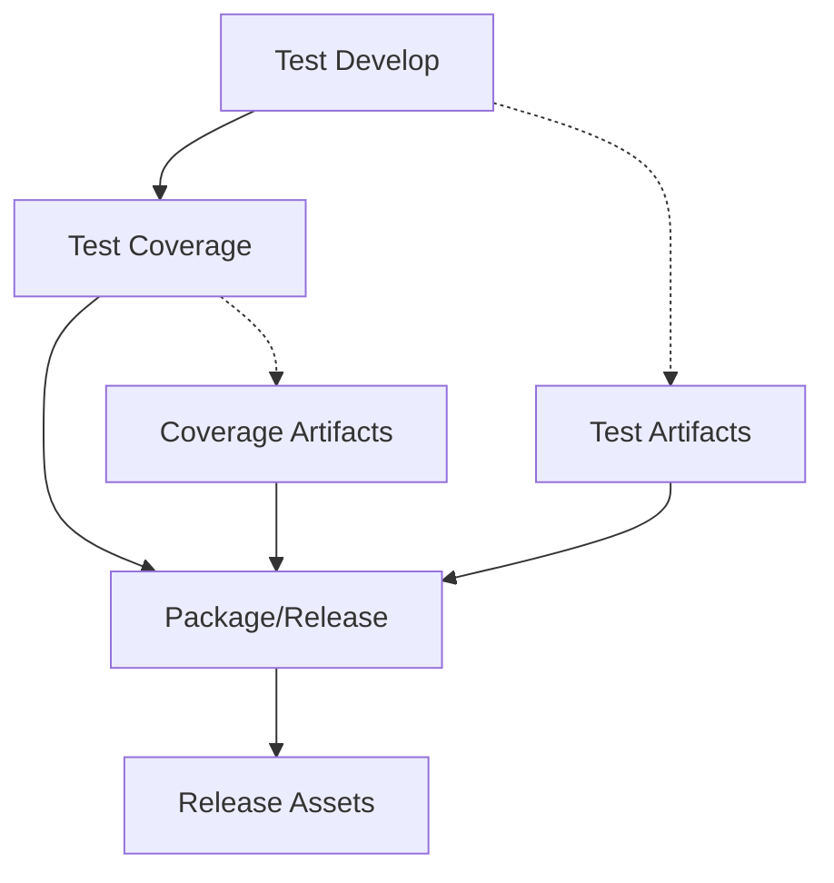

# Workflow Sequence and Permissions

This document explains the corrected workflow dependencies, permissions, and execution sequence for the QA-integrated release process.

## Workflow Execution Chain

### 1. **Test Develop Workflow** (`test-develop.yml`)
- **Triggers**: 
  - Pull requests to `production` branch
  - Manual dispatch (`workflow_dispatch`)
- **Purpose**: Run Playwright tests and generate test artifacts
- **Outputs**: 
  - `playwright-report` artifact (HTML test reports)
  - `test-videos` artifact (test execution recordings)
- **Duration**: ~5-10 minutes

### 2. **Test Coverage Workflow** (`test-coverage.yml`)
- **Triggers**: 
  - After successful completion of "Test Branch with Playwright against Vite Server"
  - Manual dispatch (`workflow_dispatch`)
- **Purpose**: Run coverage analysis and generate coverage reports
- **Outputs**:
  - `coverage-reports-{run-number}` artifact (HTML, JSON, LCOV reports)
  - `coverage-raw-data-{run-number}` artifact (raw coverage data)
- **Duration**: ~8-12 minutes

### 3. **Package Workflow** (`package.yml`)
- **Triggers**: 
  - After successful completion of "Test Coverage Evaluation"
  - Manual dispatch (`workflow_dispatch`)
- **Purpose**: Create release with integrated QA artifacts
- **Outputs**: 
  - GitHub release with multiple assets
  - Workflow artifacts for debugging
- **Duration**: ~3-5 minutes

## Workflow Dependencies



## Corrected Permissions

### Test Coverage Workflow
```yaml
permissions:
  contents: read          # Read repository content
  pull-requests: write    # Comment on PRs
  issues: write          # Create issue comments
```

### Package Workflow
```yaml
permissions:
  contents: write        # Create releases and tags
  packages: write        # Publish packages
  actions: read         # Access workflow run artifacts
  pull-requests: read   # Read PR information
```

## Artifact Access Strategy

### Problem Solved
- **Previous Issue**: Package workflow was looking for "latest successful" runs
- **Solution**: Track the specific workflow chain that triggered the package creation

### Implementation
1. **Workflow Chain Tracking**: Uses the triggering workflow run ID to find the exact test run
2. **Temporal Correlation**: Matches workflows by creation time when direct linkage isn't available
3. **Fallback Strategy**: Falls back to latest successful runs for manual triggers

### Artifact Download Process
```yaml
# 1. Find the workflow run chain
- Find coverage workflow run (triggering run)
- Find test workflow run (temporal correlation)

# 2. Download specific artifacts
- Download coverage artifacts from coverage run
- Download test artifacts from test run

# 3. Verify and process
- Extract all artifacts
- Verify content availability
- Process into release packages
```

## Conditional Package Creation

### Smart Packaging Logic
The workflow now creates packages conditionally based on artifact availability:

1. **Always Created**: Source code package
2. **Conditional**: Coverage package (if coverage data available)
3. **Conditional**: Test reports package (if test data available)  
4. **Conditional**: Combined QA package (if both coverage and test data available)

### Verification Steps
```bash
# Check coverage availability
if [ -d "coverage-reports" ] && [ "$(ls -A coverage-reports)" ]; then
  coverage_ready=true
fi

# Check test reports availability  
if [ -d "test-reports" ] && [ "$(ls -A test-reports)" ]; then
  tests_ready=true
fi

# Create packages based on availability
if [ "$coverage_ready" = "true" ]; then
  # Create coverage package
fi
```

## Release Asset Structure

### Guaranteed Assets
- `{repo-name}-src_v{version}.zip` - Source code package

### Conditional Assets  
- `{repo-name}-coverage_v{version}.zip` - Coverage reports (if available)
- `{repo-name}-test-reports_v{version}.zip` - Test artifacts (if available)
- `{repo-name}-qa-package_v{version}.zip` - Combined QA package (if both available)

### Release Description
Dynamic release description includes:
- Coverage assessment (if available)
- Test results summary (if available)  
- QA package information (if available)
- Workflow source links

## Error Handling and Fallbacks

### Missing Artifacts
- **Coverage Missing**: Package workflow continues, creates source-only release
- **Test Reports Missing**: Package workflow continues, creates coverage-only assets
- **Both Missing**: Package workflow creates source code release only

### Workflow Failures
- **Test Workflow Fails**: Coverage workflow doesn't run, no package created
- **Coverage Workflow Fails**: Package workflow doesn't run automatically
- **Package Workflow Fails**: Release creation fails, but source workflows succeeded

### Manual Recovery
```bash
# Manual trigger of any workflow
gh workflow run package.yml
gh workflow run test-coverage.yml  
gh workflow run test-develop.yml
```

## Security Considerations

### Artifact Access
- Package workflow can only access artifacts from successful workflow runs
- No cross-repository artifact access
- Artifacts automatically expire per retention policy

### Permissions Scope
- **Minimal Scope**: Each workflow has only required permissions
- **Time-Limited**: GitHub tokens expire after workflow completion
- **Audit Trail**: All artifact downloads and releases are logged

## Troubleshooting

### Common Issues

#### "No artifacts found"
- **Cause**: Source workflow didn't complete successfully
- **Solution**: Check test-develop.yml and test-coverage.yml workflow logs

#### "Workflow chain not found"  
- **Cause**: Temporal correlation failed in manual triggers
- **Solution**: Run workflows in sequence or use workflow_dispatch

#### "Release creation failed"
- **Cause**: Insufficient permissions or missing artifacts
- **Solution**: Check package.yml permissions and artifact availability

### Debug Steps
1. **Check Workflow Status**: Verify all workflows completed successfully
2. **Verify Artifacts**: Check that artifacts were uploaded in source workflows
3. **Check Permissions**: Ensure package workflow has required permissions
4. **Review Logs**: Check workflow-chain step for artifact discovery issues

## Performance Optimizations

### Artifact Size Management
- **Test Videos**: Only for failed tests (configurable in Playwright)
- **Coverage Reports**: Compressed HTML/JSON format
- **Retention**: Shorter retention for larger artifacts

### Parallel Processing
- Coverage and test artifact downloads happen in parallel
- Package creation steps run conditionally to avoid unnecessary work

### Resource Usage
- **Disk Space**: Cleaned up temporary files after packaging
- **Network**: Efficient artifact compression and transfer
- **Compute**: Minimal processing overhead in package workflow

---

*This corrected implementation ensures reliable workflow sequencing, proper artifact access, and robust error handling for the QA-integrated release process.* 